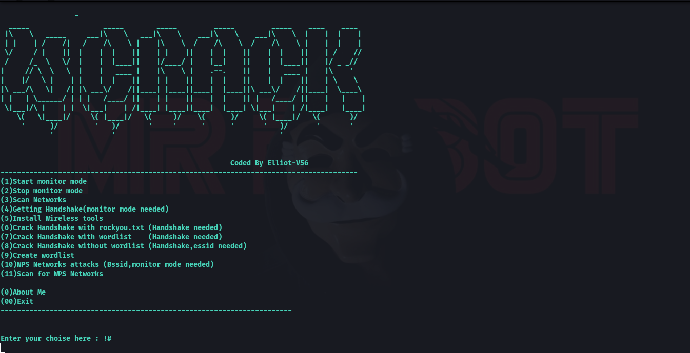
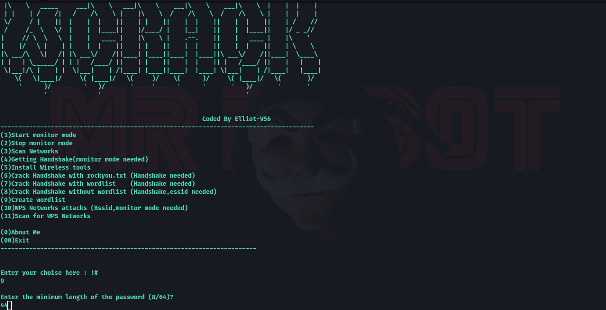

# WIFI-CrackV1.0
# WiFi Cracking Tool 🔓📡  
*A powerful security auditing tool for testing Wi-Fi network vulnerabilities (WEP/WPA/WPA2).*  


  

⚠ **Warning**: Use this tool **only** on networks you own or have permission to test. Unauthorized access is illegal.  

---

## Features  
- 🎯 **Multiple Attack Modes**: WEP, WPA-PSK, WPA2-PSK handshake capture.  
- 📡 **Deauthentication Attacks**: Force devices to reconnect for handshake capture.  
- 🔠 **Wordlist Support**: Compatible with RockYou, custom dictionaries.  
- 📊 **Automated Scanning**: Detect nearby networks and weak targets.  
- 🛠 **Offline Cracking**: Save handshakes for later analysis.  

---

## 📸 Screenshots  

### **SCREENSHOTS**  
  

### **SCREENSHOTS**  
  


## Installation  
Tested On :

    Kali Linux
    BlackArch Linux
    Ubuntu
    Kali Nethunter
    Termux ( Rooted Devices)
    Parrot OS

### Prerequisites  
- Linux
- Termux
- Python 3.x  
- `aircrack-ng`, `scapy`, `reaver` (Install via `apt`):  

```bash install in KALI-Ubuntu
1) sudo apt-get update && apt-get install git
2) sudo git clone https://github.com/ElliotV56/WIFI-CrackV1.0.git
3) cd WIFI-CRACK
4) sudo python3 WIFI-C.py
